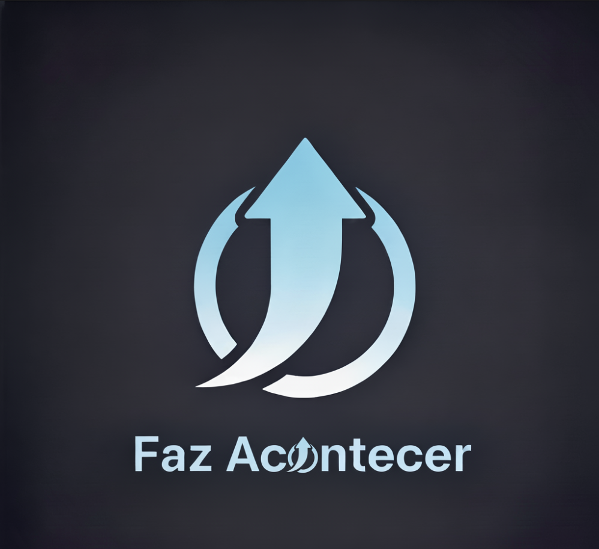

# Projeto "Faz Acontecer"

## Visão Geral

O "Faz Acontecer" é um aplicativo de gerenciamento de tarefas que vai além de um simples checklist. Seu conceito central é focado em resolver um problema comum: a falta de engajamento e a facilidade em ignorar tarefas pendentes. A solução proposta é utilizar recursos tecnológicos de forma proativa, como **alarmes persistentes**, **notificações inteligentes**, **biometria** e **geolocalização**, para garantir que o usuário se mantenha disciplinado e no controle de suas atividades diárias.

---

## Escopo do Projeto

O objetivo é desenvolver um aplicativo que funcione como um assistente pessoal, lembrando o usuário de suas responsabilidades de forma que seja quase impossível ignorá-las. A interface será limpa e direta, com a tela inicial servindo como um "Resumo do Dia".

O projeto será desenvolvido seguindo a metodologia ágil **Scrum**, com o trabalho dividido em três **Sprints** (ou ciclos de desenvolvimento).

### **MVP da Sprint 1: O Núcleo do Aplicativo**

O MVP desta fase é a espinha dorsal do aplicativo, com as funcionalidades essenciais para que ele seja utilizável e já resolva o problema central do usuário.

* **Gerenciamento de Tarefas:** O usuário consegue criar, editar e excluir tarefas, inserindo título, descrição, data e hora.
* **Alarme Implacável:** O aplicativo emite um alarme persistente que só para quando o usuário confirma que tomou ciência da tarefa.
* **Visão Geral Diária:** A tela inicial exibe um resumo claro e direto das tarefas do dia.
* **Acesso Rápido e Seguro:** O usuário pode utilizar a biometria (impressão digital ou reconhecimento facial) para acessar o aplicativo e confirmar a conclusão de uma atividade.

### **MVP da Sprint 2: Engajamento e Praticidade**

Nesta fase, o MVP foca em tornar o aplicativo mais inteligente e adaptado à rotina do usuário, adicionando recursos que aumentam o engajamento e a praticidade.

* **Lembretes por Localização:** O app usa o **GPS** para notificar o usuário quando ele se aproxima de um local específico para uma tarefa.
* **Prioridade de Tarefas:** O usuário consegue categorizar as tarefas por prioridade (urgente, importante ou opcional).
* **Notificações em Destaque:** Notificações visuais em tela cheia que bloqueiam parcialmente o celular até que o usuário interaja com a tarefa.
* **Tarefas Recorrentes:** O usuário pode configurar tarefas que se repetem diariamente, semanalmente ou em intervalos personalizados.

### **MVP da Sprint 3: Funcionalidades Avançadas e Polimento**

O MVP final desta sprint é focado em entregar os diferenciais que tornam a experiência do usuário mais completa, inteligente e segura.

* **Sincronia com o Calendário:** O aplicativo sincroniza as atividades com o calendário nativo do dispositivo.
* **Anexos de Mídia:** O usuário pode anexar imagens, documentos ou áudios às tarefas para enriquecer os detalhes.
* **Monitoramento de Produtividade:** O app oferece relatórios semanais ou mensais sobre tarefas concluídas, atrasadas ou ignoradas.
* **Backup Automático:** O sistema salva o histórico e as pendências em um backup automático na nuvem.
* **Personalização de Tema:** O usuário pode personalizar temas e cores da interface para uma experiência mais agradável.

---

## Product Backlog e Sprints

### **Sprint 1**

| Título da História de Usuário | História de Usuário | Story Points |
| :--- | :--- | :--- |
| Gerenciamento de Tarefas | Como usuário, eu quero cadastrar e editar tarefas (Título, descrição, data e hora) para registrar minhas atividades. | 5 |
| Alerta Implacável | Como usuário, eu quero que o alarme persista até que eu o desative para não me esquecer de uma tarefa. | 5 |
| Visão Geral Diária | Como usuário, eu quero ver um resumo do dia na tela inicial para saber rapidamente o que preciso fazer. | 3 |
| Acesso Rápido e Seguro | Como usuário, eu quero desbloquear o app com biometria para ter acesso rápido e seguro. | 3 |

---

### **Sprint 2**

| Título da História de Usuário | História de Usuário | Story Points |
| :--- | :--- | :--- |
| Lembretes Inteligentes por Localização | Como usuário, eu quero receber lembretes via GPS quando estiver perto de um local para não esquecer de uma tarefa lá. | 5 |
| Prioridade de Tarefas | Como usuário, eu quero categorizar tarefas por prioridade para saber o que é mais importante. | 2 |
| Notificações em Destaque | Como usuário, eu quero notificações em tela cheia para que uma tarefa importante não passe despercebida. | 3 |
| Rotina Sem Esforço | Como usuário, eu quero configurar tarefas recorrentes para não precisar recriá-las manualmente. | 3 |

---

### **Sprint 3**

| Título da História de Usuário | História de Usuário | Story Points |
| :--- | :--- | :--- |
| Sincronia com o Calendário | Como usuário, eu quero que minhas tarefas sejam sincronizadas com o calendário nativo para ter uma visão completa da minha agenda. | 5 |
| Detalhes da Tarefa | Como usuário, eu quero anexar imagens, documentos ou áudios às tarefas para ter mais detalhes. | 3 |
| Monitoramento de Produtividade | Como usuário, eu quero ver estatísticas de desempenho para monitorar meu progresso e me motivar. | 5 |
| Gamificação de Tarefas | Como usuário, eu quero ganhar recompensas simbólicas, como medalhas, para me sentir motivado a ser disciplinado. | 2 |
| Personalização de Tema | Como usuário, eu quero poder personalizar as cores e o tema do aplicativo para que a experiência seja mais agradável. | 2 |
| Descanso Garantido | Como usuário, eu quero que o app tenha um modo noturno para não ser incomodado e reorganizar os lembretes para o dia seguinte. | 3 |
