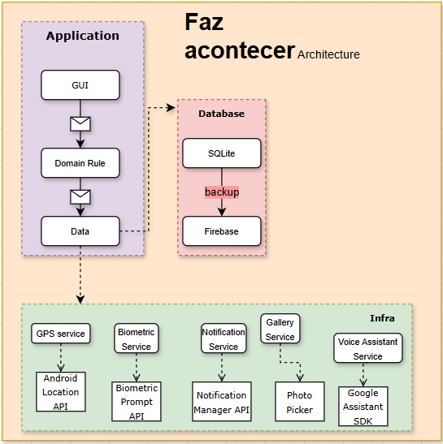

### Arquitetura do Sistema

A arquitetura do projeto é baseada em camadas para garantir a separação de responsabilidades e a manutenibilidade do código. A imagem abaixo detalha a estrutura do aplicativo e a sua comunicação com os serviços externos.

---